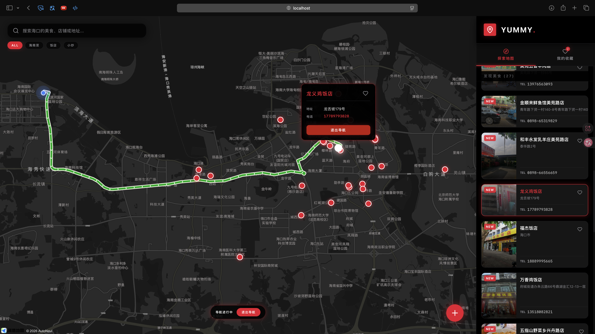
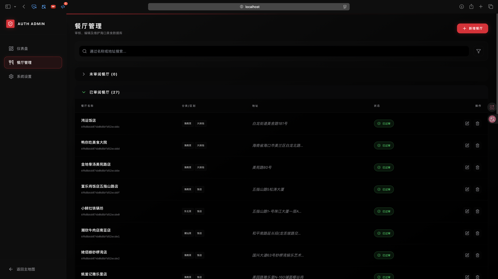
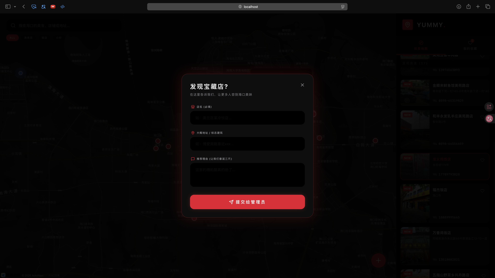

# 海口美食地图 (Haikou Yummy) 🗺️🍜

## 项目简介
**海口美食地图 (Haikou Yummy)** 是一款聚焦海南海口本地美食打卡、探店推荐的地图应用。与传统的点评软件不同，本项目致是作者羽毛球球友实际消费的“私藏馆子”，打造一个最具海口风味的美食指北。

---

## 📸 项目展示 (Gallery)

| 首页地图 | 餐厅管理 | 推荐表单 |
| :---: | :---: | :---: |
|  |  |  |

---

## 🎯 核心目标与技术栈选型

*   **平台支持**：Web 端 (响应式) + 微信小程序
*   **技术栈 (Tech Stack)**：
    *   **后端 API**：`Python` + `FastAPI` (轻量、高性能，适合快速开发和后期数据处理扩展)
    *   **数据库**：`MongoDB` (使用 MongoDB Atlas，基于文档型数据库契合位置数据和非结构化的店铺信息)
    *   **Web 前端**：`React` + `Tailwind CSS` (快速构建现代化、高颜值的界面)
    *   **小程序端**：`UniApp` (基于 Vue，一套代码编译到微信小程序)
    *   **地图服务**：高德地图 API 或 腾讯地图微信小程序插件。

---

## 🚀 发展路线图 (Roadmap)

### 阶段一：MVP 构建 (最小可行性产品) - “让地图亮起来”
**目标：跑通前后端数据链路，验证核心想法。**
*   搭建 MongoDB 数据库，设计基于 `GeoJSON` 的空间数据结构。
*   使用 FastAPI 实现核心后端接口（店铺列表、附近搜索 `$near`、店铺详情）。
*   开发 React Web 端与 UniApp 小程序端，实现基础的美食标点与详情查看功能。

### 阶段二：数据补全与内容生态 (V1.5) - “让地图丰满起来”
**目标：丰富地图数据，引入后台管理与抓取。**
*   [x] 编写轻量级爬虫（Playwright/BeautifulSoup）或集成高德 API 自动抓取点评或营业时间等缺失信息。
*   [x] 开发 React 管理后台 (Admin Panel) 审核及管理数据，实现防呆与无缝自动填充。
*   [ ] 推出 PGC (专业生产内容) 专题榜单功能（例如：海大南门夜市必吃合集）。

### 阶段三：前端 Web 互动应用开发 - [已完成 ✅]
**目标：实现高颜值的双端地图 UI 体系。**
*   [x] 支持个人收藏夹 (LocalStorage 模式)。
*   [x] 基于用户定位提供动态路线规划功能 (Tesla 风格导航)。
*   [x] 推出基础版“推荐宝藏店”表单提报功能（含 100% 汉化与 Tesla UI 自适应）。
*   [x] **核心架构优化**：实现小程序端“零闪烁”详情页加载与原生导航栏深度整合。
*   [x] 用户系统构建（支持微信登录授权预留）。

---

## 🗂️ 核心架构构想

后端数据库采用 `GeoJSON` 格式对各类餐厅地点进行存储与检索。以空间索引实现附近餐厅查询的高效能力。

---

## 🛠️ 本地开发运行

### 后端 (Backend)
1. 进入目录：`cd backend`
2. 安装依赖：`uv sync` (需安装 [uv](https://github.com/astral-sh/uv))
3. 配置 `.env` (参考 `.env.example`)
4. 运行：`PYTHONPATH=. uv run uvicorn app.main:app --reload`

### 前端 (Frontend)
1. 进入目录：`cd frontend`
2. 安装依赖：`npm install`
3. 配置 `.env` (需包含 `VITE_AMAP_KEY` 和 `VITE_AMAP_SECURITY_CODE`)
4. 运行：`npm run dev`

---

## ✨ 亮点特色

*   **数据精准**：所有 26 家餐厅经纬度、地址、电话均通过高德/腾讯 API 深度校准与补全，实拍头图 100% 覆盖。
*   **极致体验**：Tesla 车机风格的暗黑 UI 设计，配合 **Zero-Flicker 零闪烁架构**，提供极致丝滑的页面切换体验。
*   **收藏持久化**：支持本地持久化收藏夹，轻松管理心仪的小店。

---
**Haikou Yummy Project** | 2026
